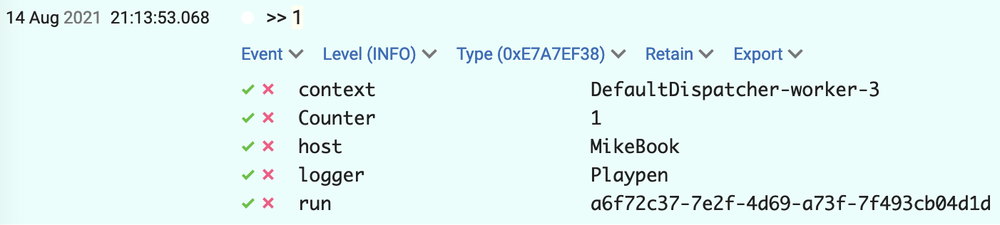

# Built-in configurations

Klogging provides a number of built-in configurations.

## Rendering

### RENDER_SIMPLE

A `RenderString` instance that renders log events as string messages suitable for a
console. Examples are:

```
2021-09-04 17:10:08.118921 INFO [DefaultDispatcher-worker-6] io.klogging.example.KloggerPlaypen : >> 1 : {run=4f1f9871-bbe9-4dcd-a778-c770d117010c, Counter=1}
2021-09-04 17:10:08.162969 INFO [DefaultDispatcher-worker-2] io.klogging.example.KloggerPlaypen : << 1 : {run=4f1f9871-bbe9-4dcd-a778-c770d117010c, Counter=1}
2021-09-04 17:10:08.163054 INFO [DefaultDispatcher-worker-5] io.klogging.example.KloggerPlaypen : Event 1 at 2021-09-04T17:10:08.162985 : {run=4f1f9871-bbe9-4dcd-a778-c770d117010c, Counter=1, Iteration=1, RightNow=2021-09-04T17:10:08.162985}
```

- The timestamp is in the server’s local time zone.
- If there are `items` as part of the [log event](../concepts/log-events.md), the keys and values
  are printed at the end of the line in curly braces.
- If there is a stack trace as part of the log event, it is printed starting on the next line.

Example usages are shown for [Configuration DSL](dsl.md), [JSON](json.md) and [HOCON](hocon.md).

### RENDER_ISO8601

A `RenderString` instance that renders log events as string messages like `RENDER_SIMPLE` but with
timestamps in ISO8601 format. Examples are:

```
2023-07-27T22:46:58.363519Z INFO [DefaultDispatcher-worker-4+Playpen] io.klogging.example.KloggerPlaypen : << 1 : {app=Playpen, run=2235f5a2-7920-4446-9fa3-bd127493772e, Counter=1}
2023-07-27T22:46:58.365417Z INFO [DefaultDispatcher-worker-4+Playpen] io.klogging.example.KloggerPlaypen : >> 2 : {app=Playpen, run=2235f5a2-7920-4446-9fa3-bd127493772e, Counter=2}
2023-07-27T22:46:58.365559Z INFO [DefaultDispatcher-worker-4+Playpen] io.klogging.example.KloggerPlaypen : Event 1 at 2023-07-28T08:46:58.365536 : {app=Playpen, run=2235f5a2-7920-4446-9fa3-bd127493772e, Counter=2, Iteration=1, RightNow=2023-07-28T08:46:58.365536}
```

- The timestamp is an ISO8601 timestamp in UTC.
- If there are `items` as part of the [log event](../concepts/log-events.md), the keys and values
  are printed at the end of the line in curly braces.
- If there is a stack trace as part of the log event, it is printed starting on the next line.

### RENDER_ANSI

A `RenderString` instance that renders log events as string messages for a console like
`RENDER_SIMPLE` but with logging levels with colour highlights, for example:


- Only the time portion of the timestamp is shown.
- Logging levels are colour-coded and right-aligned in a 5-character column.
- Context information is right-aligned in a 20-character column in square brackets.
- Logger names are right-aligned in a 20-character column. Package names are abbreviated if they do
  not fit in the space.
- Log event `items` are included in curly braces, if present.
- Stack traces, if present, start on the next line.

### RENDER_CLEF

A `RenderString` instance that converts log events into JSON using
[Compact Log Event Format](https://clef-json.org/) for dispatching to a
[Seq server](https://datalust.co/seq). An example is:

```json
{
  "@t": "2021-08-14T11:13:53.068816Z",
  "@l": "INFO",
  "@mt": ">> {Counter}",
  "host": "MikeBook",
  "logger": "Playpen",
  "Counter": "1",
  "run": "a6f72c37-7e2f-4d69-a73f-7f493cb04d1d",
  "context": "DefaultDispatcher-worker-3"
}
```

In Seq it is shown like this:



### RENDER_GELF

A `RenderString` instance that converts log events into JSON using
[Graylog Extended Log Format](https://docs.graylog.org/en/latest/pages/gelf.html#gelf-payload-specification)
for dispatching to a [Graylog server](https://www.graylog.org).
An example is:

```json
{
  "version": "1.1",
  "host": "MikeBook",
  "short_message": ">> 1",
  "timestamp": 1628939552.786044,
  "level": 6,
  "_Counter": "1",
  "_run": "f02ec82a-616c-4d2f-8ccb-c14c0a771f67",
  "_logger": "Playpen"
}
```

### RENDER_STANDARD

A `RenderString` instance that converts log events into a standard JSON format. An example is:

```json
{
  "timestamp": "2024-07-27T11:18:58.810039Z",
  "level": "INFO",
  "host": "uKW4KVMT",
  "logger": "com.splodge.mucker.service",
  "id": "13e837ba-b962-44ca-8dc3-675b64dcef6a",
  "context": "DefaultDispatcher-worker-17",
  "message": "Authenticated ID: 13e837ba-b962-44ca-8dc3-675b64dcef6a"
}
```

## Sending

### STDOUT

A `SendString` instance that prints strings to the standard output stream. See [DSL](dsl.md),
[JSON](json.md) and [HOCON](hocon.md) documentation for example usages.

### STDERR

A `SendString` instance that prints strings to the standard error stream, used like STDOUT.

## Complete configurations

These built-ins are designed to be used without further configuration. Each one uses the specifed
renderer and sink and sends events from all loggers at level `INFO` and above.

| Name               | Render with     | Send to  |
|--------------------|-----------------|----------|
| `CONSOLE_INFO`     | `RENDER_SIMPLE` | `STDOUT` |
| `ANSI_INFO`        | `RENDER_ANSI`   | `STDOUT` |
| `STDERR_INFO`      | `RENDER_SIMPLE` | `STDERR` |
| `ANSI_STDERR_INFO` | `RENDER_ANSI`   | `STDERR` |

:::info
The old names `DEFAULT_CONSOLE`, `DEFAULT_STDERR`, `ANSI_CONSOLE` and `ANSI_STDERR` are deprecated.
:::

:::note
If you need to see `DEBUG` or `TRACE` events, or include specified loggers by name, you need to
specify sinks and loggers explicitly.
:::

Example use in the [configuration DSL](dsl.md) (note the use of `()` to invoke the configuration):

```kotlin
    loggingConfiguration { CONSOLE_INFO() }
```

In [JSON](json.md):

```json
{
  "configName": "ANSI_INFO"
}
```

In [HOCON](hocon.md):

```hocon
configName = CONSOLE_INFO
```
