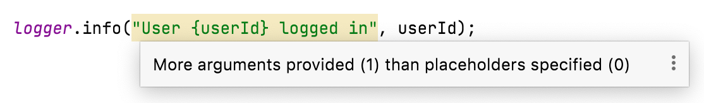

# Using Klogging with SLF4J

The [Simple Logging Façade for Java (SLF4J)](http://www.slf4j.org/) library is a widely-used
library for Java logging. It has two parts: a standard API that Java programs call; and a provider
that maps API calls to a logging framework (e.g. Logback, Log4j).

Many Java programs and frameworks, including [Spring](https://spring.io/), log using the
SLF4J API.

Klogging has an [SLF4J provider](https://github.com/klogging/klogging/slf4j-klogging)
that allows existing programs using SLF4J to switch the framework to Klogging.

[](https://search.maven.org/search?q=g:%22io.klogging%22%20AND%20a:%22slf4j-klogging%22)

:::info
Klogging supports SLF4J versions 2.x as used by Spring Boot 3 and later.
:::

## Setting up

Include this dependency in your Gradle build file:

```kotlin
    implementation("io.klogging:slf4j-klogging:0.11.0")
```

In Maven:

```xml
<dependencies>
  <dependency>
    <groupId>io.klogging</groupId>
    <artifactId>slf4j-klogging</artifactId>
    <version>0.11.0</version>
  </dependency>
</dependencies>
```

## Including values in messages

There are two options for including values in messages: SLF4J formatting with placeholders or
Klogging message templates.

### SLF4J formatting with placeholders

All existing logging statements with SLF4J formatting will continue to work with Klogging,
for example:

```java
    logger.info("Captured value {}", captured);
```

In this example, the log event contains the message with `{}` replaced by the value of
`captured` and contains no items.

### Message templates

With the Klogging provider, you can use [message templates](../context/message-templates.md)
in SLF4J logging method calls and Klogging will emit structured log events. For example:

```java
    logger.info("User {userId} logged in", userId);
```

:::note
IntelliJ IDEA will highlight message templates in SLF4J logging method calls because
they are not the positional `{}` placeholders used by SLF4J.


:::

:::caution
Klogging does not currently support messages containing both SLF4J placeholders and message
template holes.
:::

### MDC

Klogging will include any information from the Mapped Diagnostic Context (MDC)
in its log events. For example:

```java
    try (MDC.MDCCloseable closeable = MDC.putCloseable("runId", UUID.randomUUID().toString())) {
        logger.info("Started processing");
        processStuff();
        logger.info("Finished processing");
    }
```

All structured log events emitted in that block include the key `runId`
with the value for that run.
