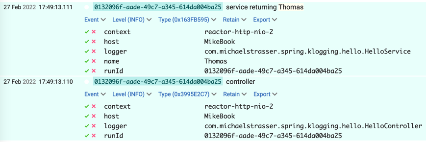

# Klogging with Spring Boot

Klogging works really well with Spring Boot, especially in Kotlin code.

You can set Klogging as the logging framework of a Spring Boot application.
The [Klogging spring boot starter](https://github.com/klogging/klogging-spring-boot-starter)
makes it simple. See [Gradle setup](#gradle-setup) below for details.

[](https://central.sonatype.com/search?smo=true&q=io.klogging%3Aklogging-spring-boot-starter)

## Using Klogging in Spring Boot

Firstly, all Spring libraries log via SLF4J and log events will be processed by Klogging.

Similarly, any existing application code that uses SLF4J will also have logs processed by Klogging.
You can also create structured log events with SLF4J.
See [Including values in messages](slf4j.md#including-values-in-messages) for more information.

### In Kotlin code

Spring Boot has first-class support for Kotlin, including coroutines. This means you can
use `suspend` functions and all of Klogging’s features for creating structured log events. A simple
example might include:

```kotlin
@RestController
class HelloController(
    val helloService: HelloService,
) : Klogging {

    @GetMapping("/hello")
    suspend fun hello(): String {
        return withLogContext("runId" to UUID.randomUUID()) {
            logger.info("controller")
            "Hello ${service.randomName()}"
        }
    }
}

@Component
class HelloService() : Klogging {
    suspend fun randomName(): String {
        return NAME_LIST.random().also {
            logger.info("service returning {name}", it)
        }
    }
}
```

Klogging will produce contextual, structured logs like this:

```
17:49:13.110069  INFO [  reactor-http-nio-2] : .k.h.HelloController : controller : {runId=0132096f-aade-49c7-a345-614da004ba25}
17:49:13.111007  INFO [  reactor-http-nio-2] : m.s.k.h.HelloService : service returning Thomas : {runId=0132096f-aade-49c7-a345-614da004ba25, name=Thomas}
```

Or in Seq log aggregator:



## Gradle setup

[](https://search.maven.org/search?q=g:%22io.klogging%22%20AND%20a:%22klogging-spring-boot-starter%22)

:::info
Klogging supports Spring Boot versions 3 and later.
:::

Use a Gradle configuration like this:

```kotlin
dependencies {
    // Exclude Logback from any Spring starters that include it.
    implementation("org.springframework.boot:spring-boot-starter-actuator") {
        exclude(group = "ch.qos.logback")
    }
    implementation("org.springframework.boot:spring-boot-starter-webflux") {
        exclude(group = "ch.qos.logback")
    }
    implementation("io.klogging:klogging-spring-boot-starter:0.6.0")
    // Other runtime dependencies.

    testImplementation("org.springframework.boot:spring-boot-starter-test") {
        exclude(group = "ch.qos.logback")
    }
    // Other test dependencies.
}
```

Spring uses [SLF4J](https://www.slf4j.org/) for sending logs and
bundles [Logback](http://logback.qos.ch/) as the default provider. The `exclude` functions shown
here
are needed to exclude Logback from Spring.

:::note

If your Spring Boot app fails to start with messages like:

```
> Task :bootRun FAILED
SLF4J: Class path contains multiple SLF4J providers.
```

and

```
Exception in thread "main" java.lang.IllegalArgumentException: LoggerFactory is not a Logback LoggerContext but Logback is on the classpath.
```

you have Spring components that explicitly include Logback, where you need to exclude it, as shown
above, including `spring-boot-starter-test`.

:::

## Maven setup

[](https://search.maven.org/search?q=g:%22io.klogging%22%20AND%20a:%22klogging-spring-boot-starter%22)

:::info
Version 0.3.0 supports Spring Boot versions 2.x and 3.x.
:::

Something like this:

```xml

<dependencies>
  <dependency>
    <groupId>org.springframework.boot</groupId>
    <artifactId>spring-boot-starter-actuator</artifactId>
    <exclusions>
      <exclusion>
        <groupId>org.springframework.boot</groupId>
        <artifactId>spring-boot-starter-logging</artifactId>
      </exclusion>
    </exclusions>
  </dependency>
  <dependency>
    <groupId>org.springframework.boot</groupId>
    <artifactId>spring-boot-starter-webflux</artifactId>
    <exclusions>
      <exclusion>
        <groupId>org.springframework.boot</groupId>
        <artifactId>spring-boot-starter-logging</artifactId>
      </exclusion>
    </exclusions>
  </dependency>
  <!-- Other runtime dependencies -->

  <dependency>
    <groupId>org.springframework.boot</groupId>
    <artifactId>spring-boot-starter-test</artifactId>
    <!-- This exclusion may not be necessary, unlike the Gradle equivalent. -->
    <exclusions>
      <exclusion>
        <groupId>org.springframework.boot</groupId>
        <artifactId>spring-boot-starter-logging</artifactId>
      </exclusion>
    </exclusions>
  </dependency>
  <!-- Other test dependencies -->
</dependencies>
```

## Configure Klogging

Put a `klogging.json` file in the `src/main/resources` directory of the project.

Here is a simple one for logging to the console.

```json
{
  "sinks": {
    "stdout": {
      "renderWith": "RENDER_ANSI",
      "sendTo": "STDOUT"
    }
  },
  "logging": [
    {
      "levelRanges": [
        {
          "fromMinLevel": "INFO",
          "toSinks": [
            "stdout"
          ]
        }
      ]
    }
  ]
}
```

